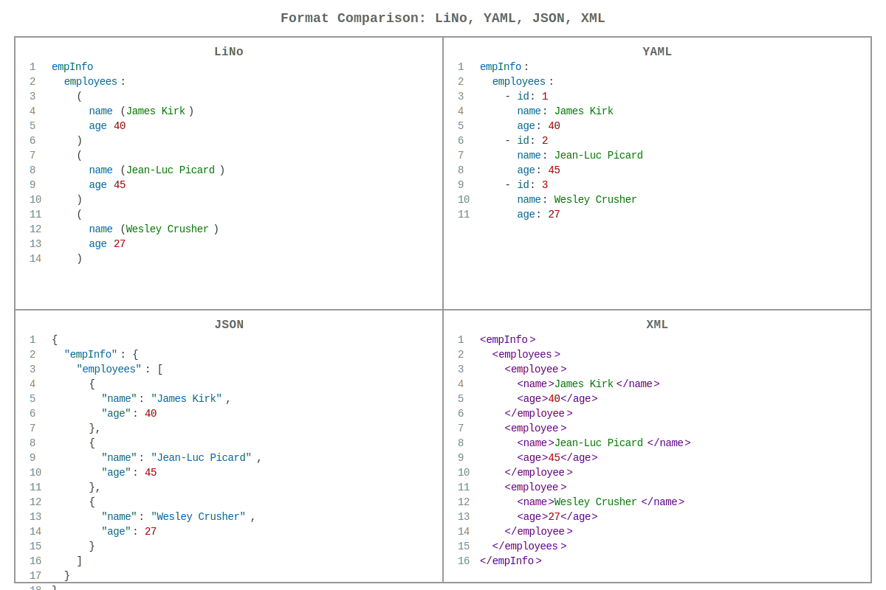

# [links-notation](https://github.com/link-foundation/links-notation) (languages: [en](README.md) • ru)

| [](https://github.com/link-foundation/links-notation/actions?workflow=js) | [](https://www.npmjs.com/package/links-notation) | **[JavaScript](js/README.ru.md)** |
|:-|-:|:-|
| [](https://github.com/link-foundation/links-notation/actions?workflow=rust) | [](https://crates.io/crates/links-notation) | **[Rust](rust/README.ru.md)** |
| [](https://github.com/link-foundation/links-notation/actions?workflow=csharp) | [](https://www.nuget.org/packages/Link.Foundation.Links.Notation) | **[C#](csharp/README.ru.md)** |
| [](https://github.com/link-foundation/links-notation/actions?workflow=python) | [](https://pypi.org/project/links-notation/) | **[Python](python/README.ru.md)** |

[](https://gitpod.io/#https://github.com/link-foundation/links-notation)
[](https://github.com/codespaces/new?hide_repo_select=true&ref=main&repo=link-foundation/links-notation)

[](https://app.codacy.com/gh/link-foundation/links-notation?utm_source=github.com&utm_medium=referral&utm_content=link-foundation/links-notation&utm_campaign=Badge_Grade_Settings)
[](https://www.codefactor.io/repository/github/link-foundation/links-notation)

Библиотека классов Link Foundation Link.Foundation.Links.Notation.



Эта библиотека дает вам возможность преобразовать любую строку,
содержащую обозначение связей, в список связей и форматировать этот
список обратно в строку после внесения изменений.

Нотация связей основана на двух концепциях: ссылка и связь. Каждая
ссылка ссылается на другую связь. Нотация поддерживает связи с любым
количеством ссылок на другие связи.

## Быстрый старт

### C&#35;

```csharp
var parser = new Link.Foundation.Links.Notation.Parser();
var links = parser.Parse("папа (любитМаму: любит маму)");
```

### JavaScript

```javascript
import { Parser } from 'links-notation';
const parser = new Parser();
const links = parser.parse("папа (любитМаму: любит маму)");
```

### Rust

```rust
use links_notation::parse_lino;
let links = parse_lino("папа (любитМаму: любит маму)").unwrap();
```

### Python

```python
from links_notation import Parser
parser = Parser()
links = parser.parse("папа (любитМаму: любит маму)")
```

## Примеры

### Нотация связей

#### Дуплеты (2-кортежи)

```lino
папа (любитМаму: любит маму)
сын любитМаму
дочь любитМаму
все (любят маму)
```

#### Триплеты (3-кортежи)

```lino
папа имеет машину
мама имеет дом
(папа и мама) счастливы
```

#### Последовательности (N-кортежи)

```lino
Я дружелюбный ИИ.
(Я тоже дружелюбный ИИ.)
(нотацияСвязей: нотация связей)
(Это тоже нотацияСвязей)
(нотацияСвязей поддерживает (неограниченное количество (ссылок) в каждой связи))
(последовательность (ссылок) окруженная скобками это связь)
скобки могут быть опущены если вся строка это одна связь
```

Это означает что *этот* текст тоже является нотацией связей. Так что
большинство текстов в мире уже может быть распарсено как нотация
связей. Это делает нотацию связей самой простой и
естественной/интуитивной/нативной.

## Что такое Нотация Связей?

Нотация Связей (Lino) - это простой, интуитивный формат для
представления структурированных данных в виде связей между
~~сущностями~~ ссылками на связи. Он разработан для того, чтобы быть:

- **Естественным**: Большинство текстов уже может быть распарсено как нотация связей
- **Гибким**: Поддерживает любое количество ссылок в каждой связи  
- **Универсальным**: Может представлять дублеты, триплеты и N-кортежи
- **Иерархическим**: Поддерживает вложенные структуры с отступами

Нотация использует две основные концепции:

- **Ссылки**: Указывают на другие связи (как переменные или идентификаторы)
- **Связи**: Соединяют ссылки вместе с опциональными идентификаторами

## Документация

Для подробных руководств по реализации и справочников API смотрите
документацию для конкретных языков:

- **[Документация C#](https://link-foundation.github.io/links-notation/csharp/api/Link.Foundation.Links.Notation.html)**
  \- Полный справочник API
- **[README C#](csharp/README.ru.md)** - Руководство по установке и использованию
- **[README JavaScript](js/README.ru.md)** - Руководство для современной
  веб-разработки
- **[README Rust](rust/README.ru.md)** - Руководство по
  высокопроизводительному парсингу
- **[README Python](python/README.ru.md)** - Руководство по работе с пакетом Python

Дополнительные ресурсы:

- [Сравнение возможностей](FEATURE_COMPARISON.md) - Анализ возможностей LINO
  по сравнению с YAML/XML/JSON

- [PDF Документация](https://link-foundation.github.io/links-notation/csharp/Link.Foundation.Links.Notation.pdf)
  \- Полный справочник для офлайн чтения
- [Теория связей 0.0.2](https://habr.com/ru/articles/804617) -
  Теоретическая основа, которую Нотация Связей полностью поддерживает
